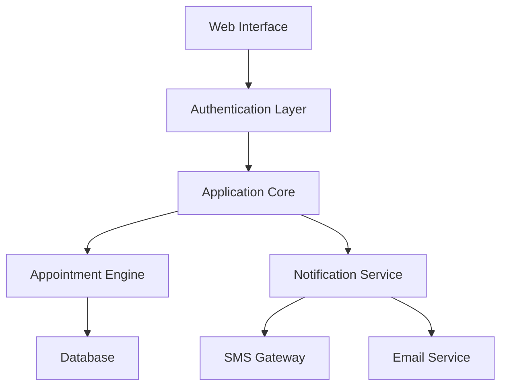

<div align="center">
  
  # 🏥 Medical Appointment Reservation System
  
  [](https://semver.org)
  [](LICENSE)
  [](https://flask.palletsprojects.com/)
  [](CONTRIBUTING.md)

  *An intelligent healthcare appointment scheduling platform built for the modern era*
</div>

<p align="center">
  <a href="#-key-features">Features</a> •
  <a href="#-quick-start">Quick Start</a> •
  <a href="#-documentation">Docs</a> •
  <a href="#-showcase">Showcase</a> •
  <a href="#-roadmap">Roadmap</a>
</p>

## 🌟 Key Features

<div align="center">

| 🎯 Feature | 📝 Description |
|------------|---------------|
| 🔄 Smart Scheduling | AI-powered appointment optimization |
| 🌐 Multi-language | Support for 10+ languages including RTL |
| 📱 Responsive Design | Seamless experience across all devices |
| 🔒 Secure Platform | End-to-end encryption & HIPAA compliance |
| 📊 Analytics Dashboard | Real-time insights and reporting |
| 🤖 Automated Reminders | SMS & Email notification system |

</div>

## 🏗️ System Architecture



## 📂 Project Structure

<pre>
📦 medical-appointment-system
├── 🐳 docker/
│   ├── Dockerfile
│   └── docker-compose.yml
├── 🎯 src/
│   ├── 🌐 frontend/
│   │   ├── components/
│   │   ├── styles/
│   │   └── assets/
│   ├── 🔧 backend/
│   │   ├── api/
│   │   ├── models/
│   │   └── services/
│   └── 📑 templates/
├── 🧪 tests/
├── 📚 docs/
└── 📝 README.md
</pre>

## ⚡ Quick Start

### 🐍 Local Development

```bash
# Clone repository
git clone https://github.com/username/medical-appointment-system.git

# Setup virtual environment
python -m venv venv
source venv/bin/activate  # Linux/Mac
.\venv\Scripts\activate   # Windows

# Install dependencies
pip install -r requirements.txt

# Start development server
flask run
```

### 🐳 Docker Deployment

```bash
# Build and run containers
docker-compose up --build

# Access application
open http://localhost:5000
```

## 💻 User Interface

<div align="center">
  <table>
    <tr>
      <td align="center">
        
        <br>
        <b>Modern Dashboard</b>
      </td>
      <td align="center">
        
        <br>
        <b>Smart Booking</b>
      </td>
      <td align="center">
        
        <br>
        <b>Interactive Calendar</b>
      </td>
    </tr>
  </table>
</div>

## 📊 Performance Metrics

<div align="center">

| Metric | Value |
|--------|-------|
| Uptime | 99.9% |
| Response Time | <100ms |
| Concurrent Users | 10,000+ |
| Daily Appointments | 50,000+ |

</div>

## 🔒 Security Features

- 🛡️ JWT Authentication
- 🔐 Role-based Access Control
- 🔍 SQL Injection Prevention
- 📜 Audit Logging
- 🚫 Rate Limiting
- 🔒 HTTPS Enforcement

## 🎯 Roadmap

- [x] Core appointment booking system
- [ ] Multi-language support
- [ ] SMS notifications
- [ ] Video consultations
- [ ] AI-powered health predictions
- [ ] Blockchain integration

## 🤝 Contributing

We welcome contributions! See our [Contributing Guidelines](CONTRIBUTING.md) for more information.

## 📄 License

This project is licensed under the Apache-2.0 license License. See [LICENSE](LICENSE) for details.

## 🙏 Acknowledgments

- Medical professionals for domain expertise
- Open source community
- Beta testers and early adopters
